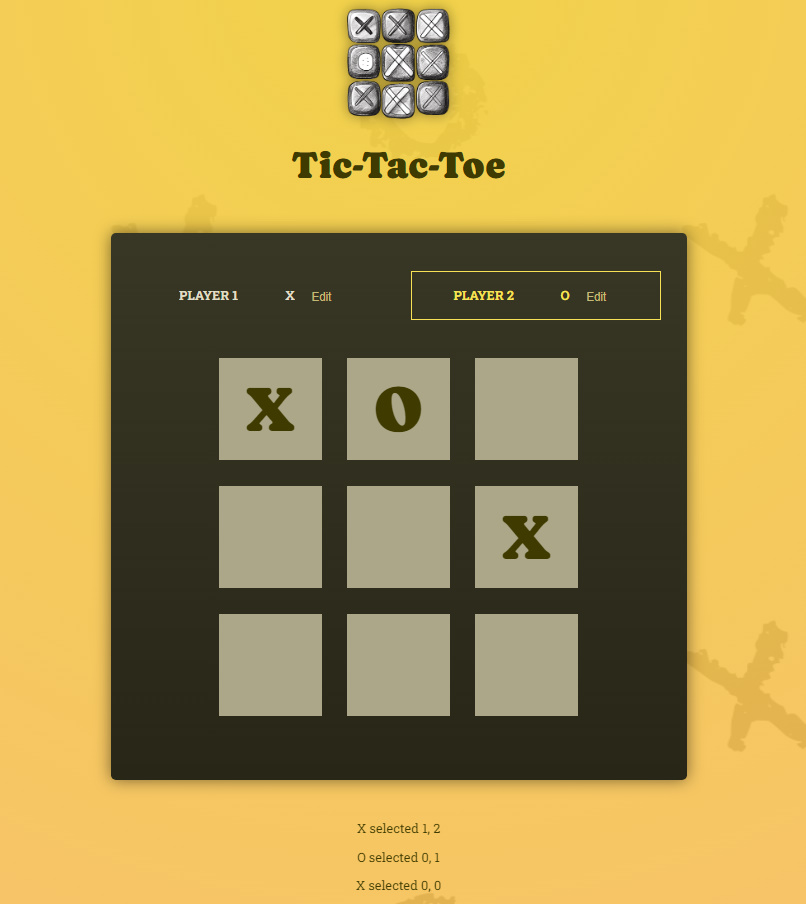

# Tic Tac Toe Game

## Features:

### Gameplay Mechanics:
- Players can take turns marking squares on a 3x3 grid.
- The game alternates between two players, traditionally represented by 'X' and 'O'.
- The game ends when a player achieves a winning combination or when all squares are filled without a winner (draw).
- Players can restart the game at any point.

### User Interface:
- Interactive game board where players can select squares to make their moves.
- Player names are displayed, and the active player is highlighted.
- Clear indication of the winner or if the game ends in a draw.
- Option to restart the game after completion.

### Customization:
- Players can customize their names at the start of the game.
- Flexibility to change player names during gameplay.

### React Concepts:
- Utilization of React hooks (`useState`) for managing game state.
- Component-based architecture for organizing UI elements (`Player`, `GameBoard`, `Log`, `GameOver`).

### Game Logic:
- Implementation of winning combinations check to determine the winner.
- Handling of draw scenarios when all squares are filled without a winner.

.

