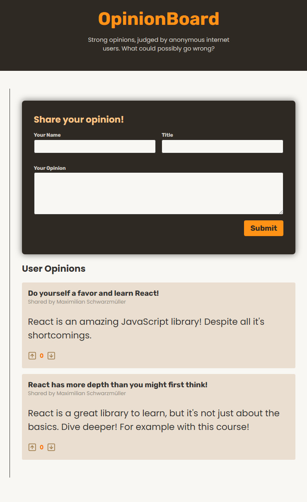

# Practice: Handling Form via Form Actions

This project demonstrates how to handle forms and actions effectively in a React-based application. It showcases a fully functional opinion-sharing feature, including opinion submission, validation, and voting mechanisms.

## Topics Covered

### 1. **React Components**
- Modular design using components such as `Header`, `Opinions`, `NewOpinion`, and `Opinion`.

### 2. **Context API**
- Managing global state using `OpinionsContext` and `OpinionsContextProvider`.
- Sharing and updating state across multiple components.

### 3. **Form Handling**
- Implementing form actions with `useActionState`.
- Validating user input and handling errors dynamically.
- Pre-filling form fields with previously entered values.

### 4. **Optimistic UI Updates**
- Using `useOptimistic` to update the UI without waiting for server responses.
- Smooth upvote and downvote functionality with immediate feedback.

### 5. **REST API Integration**
- Fetching data from a backend server (`http://localhost:3000/opinions`).
- Submitting data using HTTP POST requests.
- Keeping the frontend in sync with backend changes.

### 6. **State Management**
- Using `useState` for local state within the context provider.
- Dynamically updating state for adding and voting on opinions.

### 7. **Error Handling**
- Displaying validation errors inline in forms.
- Providing meaningful feedback to users during form submission.

## Project Structure

### **Components**
- `Header` - Displays the application header.
- `NewOpinion` - Handles the submission of new opinions via a form.
- `Opinions` - Displays a list of all opinions.
- `Opinion` - Represents a single opinion with voting functionality.

### **Context**
- `OpinionsContext` - Provides state and functions for managing opinions globally.
- `OpinionsContextProvider` - Wraps components with context to share state.

### **Utilities**
- `useActionState` - Custom hook for managing form actions and state transitions.
- `useOptimistic` - Custom hook for optimistic UI updates during voting.

## How to Run the Project

1. **Clone the Repository**
   ```bash
   git clone <repository-url>
   cd <repository-directory>

